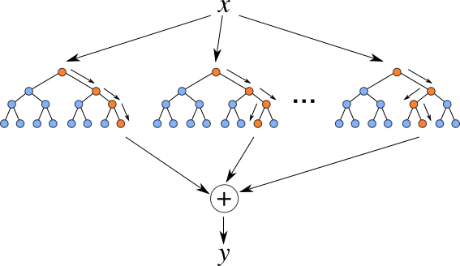

# Methodology

## Linear regressions
As already mentioned before, the first part of our methodology consists of replicating the research conducted by @Cremers2021. In other words, we test whether the treasury implied volatility can be used to predict the future macroeconomic real activity.

To quantify the predictability of macroeconomic real activity using the treasury implied volatility, we run an ordinary least squares (OLS) regression. In the first regression, we take the 5-year YIV and use it to predict the forward-looking GDP growth. To specify, GDP~i,t+j~ refers to  logarithmic values of year-on-year quarterly growth rate of the real GDP. H is equal to the periods predicted - e.g. if H=4, it means that we are taking the rolling overlapping average of GDP growth over the next 4 quarters. 

\begin{equation}
\frac{1}{H} \sum_{j=1}^{j=H}log(1+GDP_{i,t+j})/H = \alpha_{H}+ \beta_{H} \sigma_{IV,t} + \varepsilon_{t+H}
\end{equation}


In the linear models, we compare the predictive ability of YIV within different time periods (H=1,2,3,..,12). We also check whether there exist any asymmetries regarding economic cycle phases - i.e. if YIV exerts a bigger/smaller effect on GDP when the current state is a recession or an expansion. To do so, we introduce a model with a dummy variable that is equal to 1(0) during a recessionary (expansionary) period. The business cycle dating (i.e. recessionary and expansionary periods) for the US economy is taken from the National Bureau of Economic Research (NBER).

\begin{equation}
\frac{1}{H} \sum_{j=1}^{j=H}log(1+GDP_{i,t+j})/H = \alpha_{H}+ \beta_{H} \sigma_{IV,t} + Dummy +\varepsilon_{t+H}
\end{equation}

Furthermore, to validate YIVs predictive ability, we construct different models by adding in various financial and economical control variables to see whether the significance of our main variable persists. The control variables include term spreads, credit spreads, stock market implied volatility (VIX), number of new residential construction starts (HOUSNG). In order to enable the comparison of the variables, we standardize all of the independent variables so the mean is equal  to 1 and standard deviation to 0. Furthermore, all of our reported coefficients as well as standard errors are adjusted for heteroskedasticity and also autocorrelation (HAC) - to do so, we use the Newey-West methodology with automatic bandwidth selection process.


\begin{equation}
\frac{1}{H} \sum_{j=1}^{j=H}log(1+GDP_{i,t+j})/H = \alpha_{H}+ \beta_{H} \sigma_{IV,t} + Dummy + Controls +\varepsilon_{t+H}
\end{equation}

Next, to determine the direction of the causality, we run a Vector Autoregressive model (VAR) Granger Causality test on every variable to make sure that e.g. YIV indeed granger-causes movements in GDP. 


## Out-of-sample validation

After having done the regression with YIV, subsample dummy and controls as independent variables, we proceed with conducting an out-of-sample test to validate the robustness of the model. To evaluate the robustness of the out-of-sample forecast we use the root mean square forecasting error (RMSFE). 


\begin{equation}
\begin{gathered}
SFE = \sum_{j=1}^{j=H}(log(1+GDP_{i,t+j}) - \widetilde{log({1+GDP}_{i,t+j})}^2 \\
RMSFE =  \sqrt{mean(SFE)} (\#eq:sfe)
\end{gathered}
\end{equation}
where $log(1+GDP_{i,t+j)}$ refer to actual values and $\widetilde{log(1+GDP_{i,t+j})}$ to predicted values.

To calculate the full model RMSFE we first have to obtain square forecasting errors (SFE). This is done by constructing a predictive model with a 5-year rolling estimation window. This means that we use the previous 20 quarters to predict the next H quarters (note: here H denotes average quarterly year-on-year growth rates H quarters ahead as in the original paper). The reason behind opting for rolling estimation window is that in this way the predicted datapoint is continuously moving; thus the forecast error is not so much dependent on the selected forecast interval (i.e. there would be big differences if one used 85 datapoints to predict 20 datapoints, or 70 datapoints to predict 35 datapoints). From that regression we obtain the predicted values which together with the actual values can be used to compute the SFE-s (see Equation \@ref(eq:sfe)). Having the SFE-s, we take the mean from the values and then take the square root to obtain RMSFEs..

## Out of sample validation for different economic cycle phases

In the second part of our research we build upon the research conducted by @Cremers2021. We test whether the model holds when accounting also for the possible business cycle performance asymmetries as suggested by @Siliverstovs2020. More specifically, we compare the root-mean-square-forecasting-error (RMSFE) of the predictive model during recession and expansion with full sample forecast to find out whether full sample forecast’s RMSFEs are robust during the expansionary and recessionary subsamples. 

For this part of the research we shift our dependent variable from being average quarterly year-on-year growth rates (denoted as H1, H2, and etc. as in the original paper) to quarterly growth rates of GDP h-quarters ahead (denoted in our paper as F1, F2, and etc.). The reason for that lies in the underlying formulas of these dependent variables. In Appendix \@ref(S:BSnote) we have dissected three formulas for the dependent variables used in the academia. The first is average quarterly year-on-year growth rates (as is used by @Cremers2021), the second is h-step ahead average quarterly growth rate, and the last one is h-step ahead quarterly growth rate. We have taken H4 as a comparison point for these three variables. As it can be see from the average quarterly year-on-year growth rates 4 quarters ahead, the variable relies more heavily on the point near the current time period (e.g. more weight on t, t+1, and t+2 growth rates while relying less on t+3 and t+4). The next variable i.e. the h-step ahead average quarterly growth rate weighs the next four quarters' growth rates equally. However, the pitfall is that the actual and predicted values are smoothed significantly due to the averaging so as the period increases, the squared errors become smaller. Thus, the model using this growth rate variable would produce smaller RMSFEs in the future periods as the extremes are averaged out (see Appendix \@ref(S:gdpversions). The last variable, h-step ahead quarterly growth rate, is calculated only based on the GDP growth rate 4 quarters ahead.

Based on the aforementioned, we decided to use the h-step ahead quarterly growth rate for RMSFE predictions as it focuses strictly on the forecasted quarter's growth rate and eliminates the problem with unequal weighting and unproportionate RMSFE in the further forecasting horizons.


To calculate the recessionary subsample RMSFE, we first obtain SFE-s through doing the full regression as described before, however, in calculating RMSFE we take only the SFE-s related to recessions (according to NBER classification). Based on those recessionary SFE-s we calculated the RMSFE. Similarly, in expansionary-only RMSFE calculation we excluded those recessionary SFE-s.

\begin{equation}
rRMSFE = \frac{RMSFE_{subset}}{RMSFE_{full}}
\end{equation}

To offer a better comparison of the models forecasting performance, we assess the sub-models with expansionary & recessionary data points compared to benchmark model by calculating relative root mean square forecasting error (rRMSFE).
In the case of the formula having a value smaller than 1 indicates that the subset model does have a superior performance over the fullsample model.

### Cumulative sum of squared error difference

As the recessionary periods in comparison with expansionary periods have less observations, there might be a reason to doubt the conclusion drawn from such few observations. To tackle this, we use the cumulative sum of squared forecast error difference (CSSFED) proposed by @Welch2008. Even though the main use-case for the CSSFED is to compare the forecast performance of different models, it has another feature even more useful to our research - it helps to dissect the forecast error and hence see whether the (dis)improvement of relative performance is due to actual continuous (dis)improvement or it is dependent on few influential observations. Thus, the CSSFED is applied in order to test how the few observations of recessions impact the whole forecasting error. As mentioned by @Siliverstovs2021, there is reason to believe their influence on the whole sample forecast error is crucial. In other words, recessionary periods RMSFE is more influential and outweighs the importance of expansionary periods RMSFE. 

The CSSFED can be calculated according to the formula below:

\begin{equation}
CSSFED = \sum_{t=1}^{T}[(e_{benchmark,t})^2 - (e_{advanced,t})^2]
\end{equation}

where e~benchmark,t~ refers to forecast errors of benchmark model, and e~advanced,t~ of the advanced model at time t.

The resulting figure can be plotted over time to visually identify how each observation contributes to the cumulative forecasting error difference - i.e. if each datapoint increases the forecast error difference, the graph shows an upwards trend. This means that the advanced model continuously outperforms the benchmark model. Contrarily, if little difference exists between each observation’s error differential, the graph will stay fairly smooth. In the case when one observation’s sum of forecasting error difference (SFED) is significantly bigger from the previous ones, big jumps can be identified on the graph - these jumps mark the observations with largest influence on the overall relative forecasting performance. 


## Machine learning methods
As ML methods successfully tackle nonlinearities that cannot be accounted for in simple linear models, the forecasting gains tend to be the highest during times of high economic uncertainty @Coulombe2020a. As our research includes economic crises, we expect to find forecasting gains by utilizing RF. In our research, we focus specifically on RF model due to its advantages discussed in the literature review.


### Decision Trees
In order to dig deeper into the methodology of RF, it is crucial to understand one of its core elements - decision trees. Decision tree is a rather straightforward algorithm that can be used for both regressions and classifications. The name ‘decision tree’ derives from the fact that the algorithm is built in a tree-like structure: it recursively divides (splits) the whole sample into two subsets by user-defined criteria. In our case, trees are used for regressions and as the dependent variable is continuous, the selected criteria for each split is to reduce mean squared error (MSE). Thus, the algorithm takes the whole dataset and picks the variables that possess the biggest influence on the dependent variable, and then splits the dataset further until stopping criteria is met. Consequently, it arrives at the final (leaf) node where the decision is made. The stopping criteria are hyper-parameters defined by the user such as maximum depth, minimum leaf size (no of observations in the leaf node), minimum number of samples, etc [@Zhang2019]. 

As decision trees are non-parametric, there are no strong assumptions about the underlying data and its form, which in return enables capturing  non-linearities in the data. However, this makes them subject to overfitting - it might be the case that the algorithm might start capturing random movements (noise) instead of actual meaningful patterns. There are three main ways to tackle this: 

1) Tuning the hyperparameters
2) Pruning - growing the full tree and then eliminating decision nodes so that the general accuracy preserves
3) Random forest

### Random Forest

Decision Trees are not a robust method as the results are extremely dependent on the dataset, even a small change in the initial training data can yield different outcomes. This is the very reason why RF was proposed by @Breiman2001. RF itself is an ensemble based supervised learning method. As the name suggests there are two main elements behind it. 

(ref:verikas) [@Verikas2016]
```{r randomf, echo=F, out.width = "450px", fig.cap="Random forest. Figure from (ref:verikas)", fig.align="center"}

```


First is the randomness part - RF uses bootstrap aggregation (bagging) to construct random samples of the initial training dataset. Furthermore, the randomness is also included in variable selection - it randomly selects n number of variables of the total set N used for splitting at each node.
Secondly, forest, which refers to the aggregation means that the conclusion of the final model is reached by aggregating and averaging the output of individual decision trees. These two elements help to tackle overfitting as RF randomly creates a high number of combinations on the basis of which to create splits, which reduces the correlations betweens samples [@Zhang2019]. Hence, the final outcome is much more robust and less likely to be subject to overfitting.

To take this process together in algorithmical terms: 

1) Through bootstrap aggregation a sample set out of the predefined training data X is created.
2) Then the model randomly selects  n number variables amongst the total set N. 
3) Subsequently, the best variable and splitting criterion is selected, on the basis of which the current node is splitted into two sub-nodes. More specifically, the choice is  made on the basis of mean squared error (MSE)  - MSE is minimized at each split.
4) This process is repeated until each terminal node reaches minimum size (by default 5 observations) and then model prediction k is made.
5) The output k is achieved by averaging the estimations of each tree(k1..kb) in the model.

